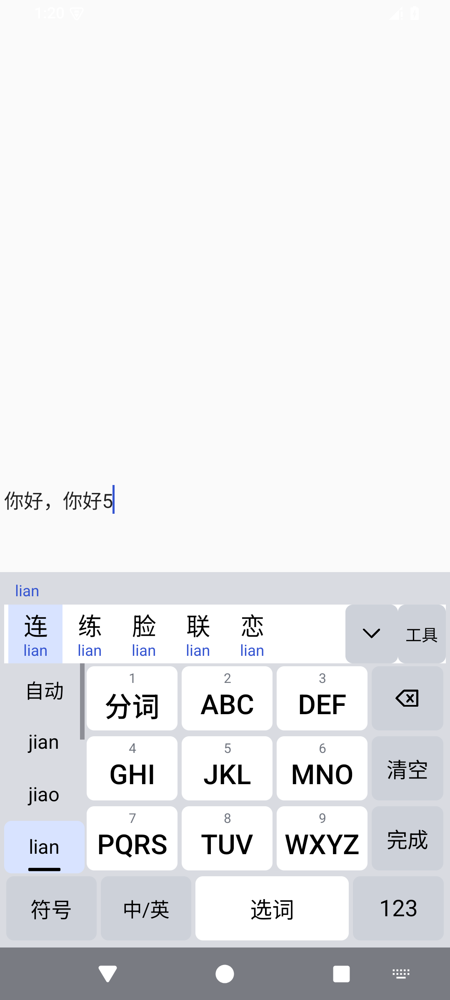

<!-- Copyright © 2026 立方田 <managecode@gmail.com> -->
# 知墨 Zhimo：让表达更自由，让输入留在本机

**拼音、手写、离线语音，一个正在成长的开源输入法。**

每天，我们都在键盘上敲下许多话：一句问候、一段工作记录，或者一个刚刚冒出来的想法。

输入法离这些表达很近。我们希望它顺手，也希望自己能了解它如何工作、如何处理输入。

这就是开发 **知墨输入法 Zhimo** 的初衷：把拼音、手写和语音转文字放进一个离线优先、源码开放的输入工具里，让不同的表达方式都有入口。

现在，Zhimo 已发布 Android、Windows、Ubuntu 和 Debian 的开发预览安装包，邀请你一起试用、反馈，让它逐步变得更好用。

## 熟悉的拼音，也可以更懂你的选择

习惯全拼，可以输入 `nihao`；想少敲几下，也可以试试简拼 `nh`。

Zhimo 支持全拼、简拼和候选选择。Android 提供九键与 26 键布局：既保留熟悉的输入方式，也支持手动分词，以及九键下的拼音候选切换。

*图：Zhimo 开发过程截图，展示拼音与汉字候选；并非本次发布 APK 的最新实机截图，界面以安装版本为准。*

输入法的“顺手”，还来自一次次选词。Zhimo 已具备本地词频学习能力，希望让你经常选择的词和组合，更容易在下一次输入时找到。具体学习策略与排序会随平台、引擎和设置有所不同。

桌面端也照顾了直接输入拼音的场景：输入 `jixu` 后，空格用于确认汉字候选，回车则提交原始拼音 `jixu`。想打中文，还是保留字母，由你决定。

*图：Zhimo 开发过程截图。左侧选择 `lian`，上方显示对应汉字候选；并非本次发布 APK 的最新实机截图。*

## 一时想不起拼音？试着写下来

有时候，一个字就在脑海里，却一时想不起读音。

Zhimo 提供离线手写入口：写下笔迹、查看候选，再点选需要的文字；写错时可以撤笔、清空重写。

桌面端目前以单字手写为主，Android 还在持续改进字形识别和连写能力。我们不把“能识别”当成“总能识别对”：不同笔顺、连笔和相近字形，仍然需要更多真实样例来打磨。

如果你愿意反馈，请告诉我们“写的是什么字、哪里识别错了”。一个清晰的样例，往往比一句“识别不好”更能帮助改进。

## 不方便打字时，把话说出来

除了拼音和手写，Zhimo 还提供离线语音转文字。

当前预览包内置语音模型，在本机完成录音后的识别，再由你预览、确认上屏；不需要把录音交给云端转录服务。这不是实时流式听写，速度和效果也会受到设备性能、环境噪声及发音的影响。

把模型放进安装包，也意味着包体积会更大。本次 Android APK 约 181 MiB——这是内置离线能力带来的实际取舍，我们会继续优化。

## 不只是一个 App，也是可复用的输入法底座

Zhimo 的核心使用 Rust，通过统一接口连接各平台界面。我们的长期目标，是让词库、学习、手写和语音能力能够复用，方便开发者继续扩展其他语种和输入方式。

当前可下载的预览包包括：

- **Android**：Android 8.0 及以上，提供内置模型的 APK。
- **Windows**：面向 64 位系统，包含 x64 与 x86 TSF 组件。
- **Linux**：Ubuntu 24.04、Debian 12 的 amd64 DEB，提供 IBus 与 Fcitx5 接入。

macOS 与 iOS 仍在开发中，不属于本次已交付安装包的范围。

## 开源，从一次真实的试用开始

Zhimo 还不是成熟稳定的成品。当前是开发预览版：Android 使用调试签名，Windows 包未签名；本轮 Android 完成了构建和包校验，但没有进行新一轮真机验收。桌面应用兼容、手写准确率和真实设备上的语音体验，也都需要继续验证。

如果你愿意尝鲜，欢迎下载测试；如果你擅长开发、设计、词条校对或测试，也欢迎参与。反馈前，请遮挡截图中的私密内容，不上传密码、个人词库或未经同意的录音。

项目源码采用 Apache-2.0 许可证，第三方组件、词库和模型保留各自许可证，详情见仓库声明。

**让每一次输入，都更贴近自己的表达。知墨，期待和你一起成长。**

👉 [下载 Android、Windows 与 Linux 预览版](https://github.com/managecode-commits/zhimo/releases/tag/v0.1.0-preview.20260915.1)

👉 [查看源码、了解项目](https://github.com/managecode-commits/zhimo)

👉 [提交问题与建议](https://github.com/managecode-commits/zhimo/issues)

作者：立方田 · 联系邮箱：managecode@gmail.com
